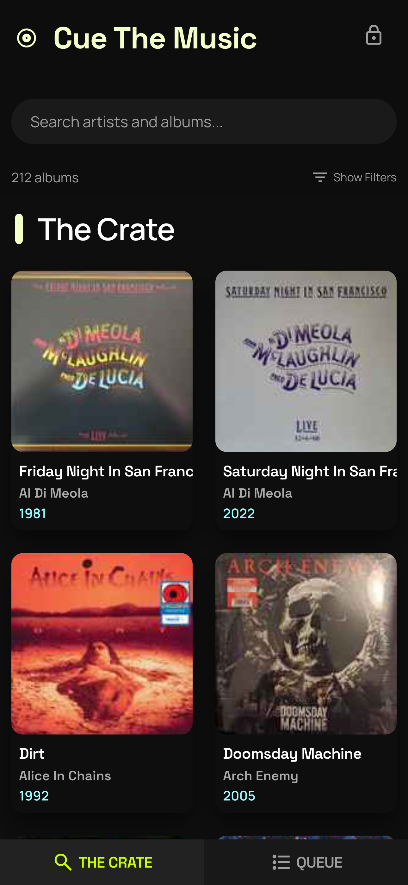
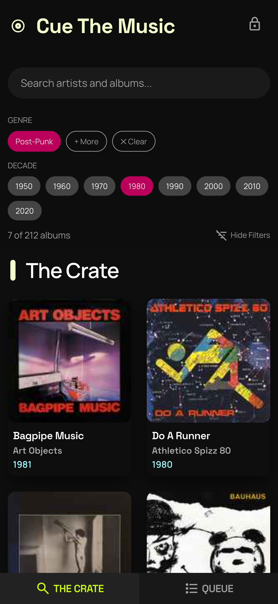
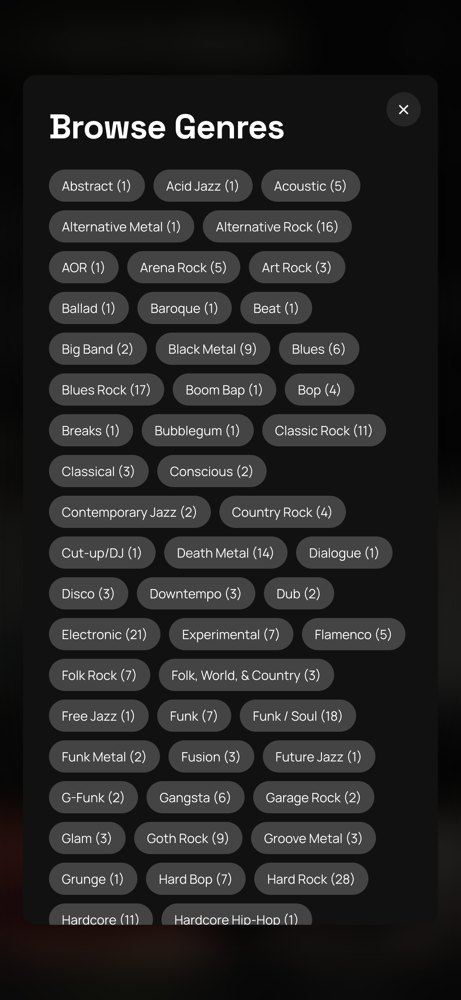
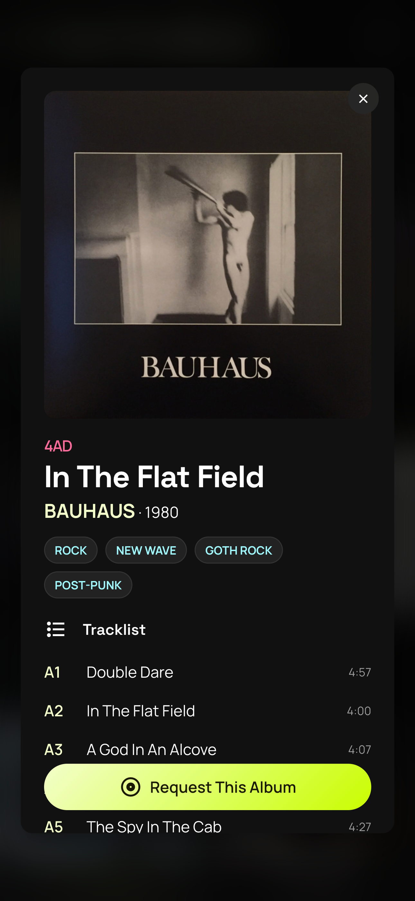
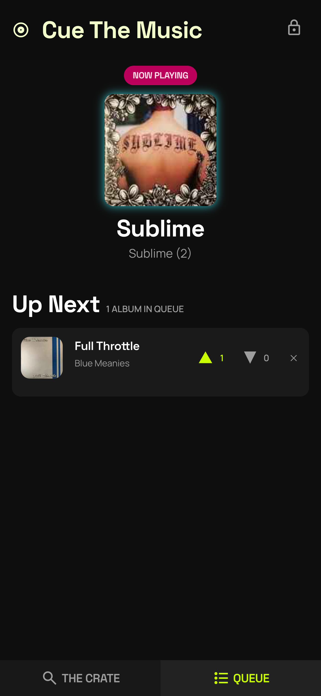
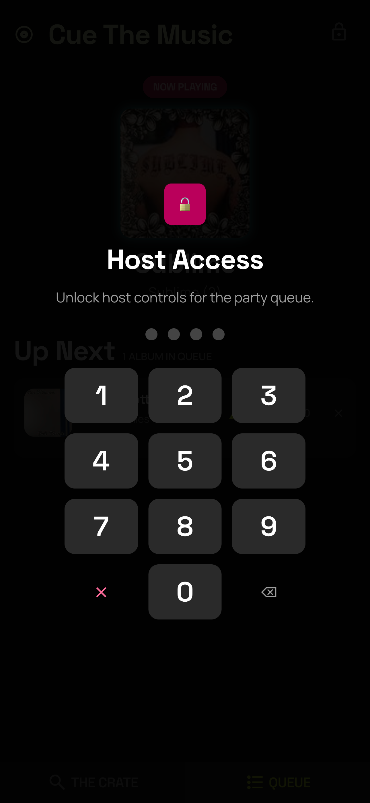
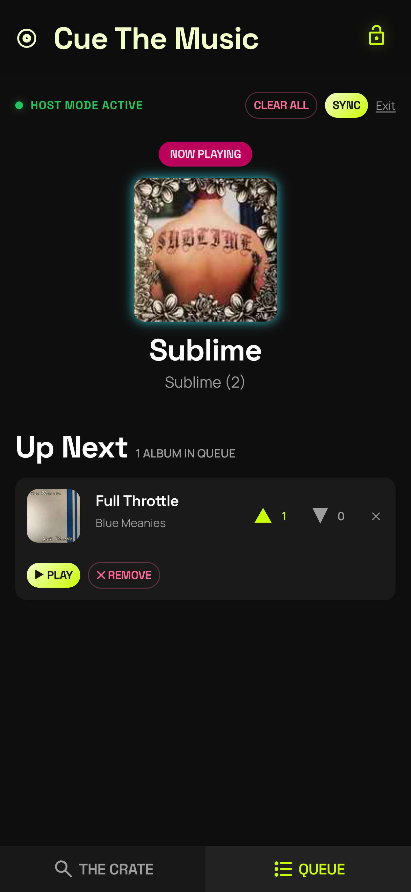

# Cue the Music

A local-network web app for dinner parties and home listening sessions. Guests connect via Wi-Fi, browse the host's record collection (synced from Discogs), and request albums to be played. Requests appear in a shared queue visible to everyone. Guests can up- or down-vote requests; the host has a PIN-activated control layer to manage the queue and trigger Discogs sync.

No user accounts. No login. Identity is tracked by IP address only.

## Features

### The Crate





**Guests** browse the collection, search and filter by genre or decade, view album details with tracklists, and request albums to the queue. Each guest can have up to three active requests and one vote per album.

### The Queue



**The Queue** is first-come-first-served. Votes don't reorder it — down-votes surface as skip signals for the host. Everything updates in real time via Server-Sent Events.

### Host Mode




**Host Mode** is activated by entering a PIN. The host can play or remove any album, clear the queue, trigger a Discogs collection sync, and see down-vote counts highlighted.

### Discogs Sync

**Discogs Integration** syncs the host's vinyl collection including artist, title, year (resolved from master releases), genre/style tags, cover art, and tracklists.

## Prerequisites

- [Node.js](https://nodejs.org/) 22+
- [Python](https://www.python.org/) 3.13+
- [uv](https://docs.astral.sh/uv/) (Python package manager)
- [Discogs personal access token](https://www.discogs.com/settings/developers)

## Setup

```bash
git clone https://github.com/craigmaslowski/cue-the-music.git
cd cue-the-music
npm install
```

Create a `.env` file in `apps/backend/`:

```bash
cp .env.example apps/backend/.env
```

Edit it with your Discogs credentials and a host PIN:

```env
DISCOGS_TOKEN=your_discogs_personal_access_token
DISCOGS_USERNAME=your_discogs_username
HOST_PIN=1234
```

Run database migrations:

```bash
cd apps/backend && uv run alembic upgrade head
```

## Development

Start the backend and frontend in separate terminals:

```bash
# Backend (port 8000)
cd apps/backend && uv run uvicorn cue_the_music.main:app --reload --host 0.0.0.0

# Frontend (port 4200)
npx nx serve @cue-the-music/frontend
```

Open `http://localhost:4200` in your browser.

### Other Commands

| Command                                    | Description               |
| ------------------------------------------ | ------------------------- |
| `cd apps/backend && uv run pytest`         | Run backend tests         |
| `npx nx typecheck @cue-the-music/frontend` | TypeScript type checking  |
| `npx nx build @cue-the-music/frontend`     | Production frontend build |
| `npx nx run-many -t test`                  | Run all tests             |

## Production (Docker)

Deploy on a home server with Docker Compose. Two containers: nginx serving the frontend build, uvicorn running the backend with SQLite persisted in a Docker volume.

```bash
# First-time setup
cp .env.example .env
# Edit .env — set your Discogs credentials, HOST_PIN, and VITE_API_BASE_URL
# VITE_API_BASE_URL should be http://<your-server-lan-ip>:8000
docker compose up -d
```

Guests connect to `http://<your-server-lan-ip>:8080`.

| Command                                  | Description                |
| ---------------------------------------- | -------------------------- |
| `docker compose up -d`                   | Start                      |
| `docker compose up -d --build`           | Rebuild after code changes |
| `docker compose logs -f`                 | View logs                  |
| `docker compose down`                    | Stop                       |
| `docker volume rm cue-the-music_db-data` | Reset database             |

## Tech Stack

**Frontend:** React 19, Vite 7, TanStack Router + Query, Zustand, Ark UI + Panda CSS

**Backend:** FastAPI, Python 3.13, SQLAlchemy + SQLite, Alembic, Discogs API

**Monorepo:** NX 22

**Production:** Docker Compose, nginx, uvicorn

## License

MIT
