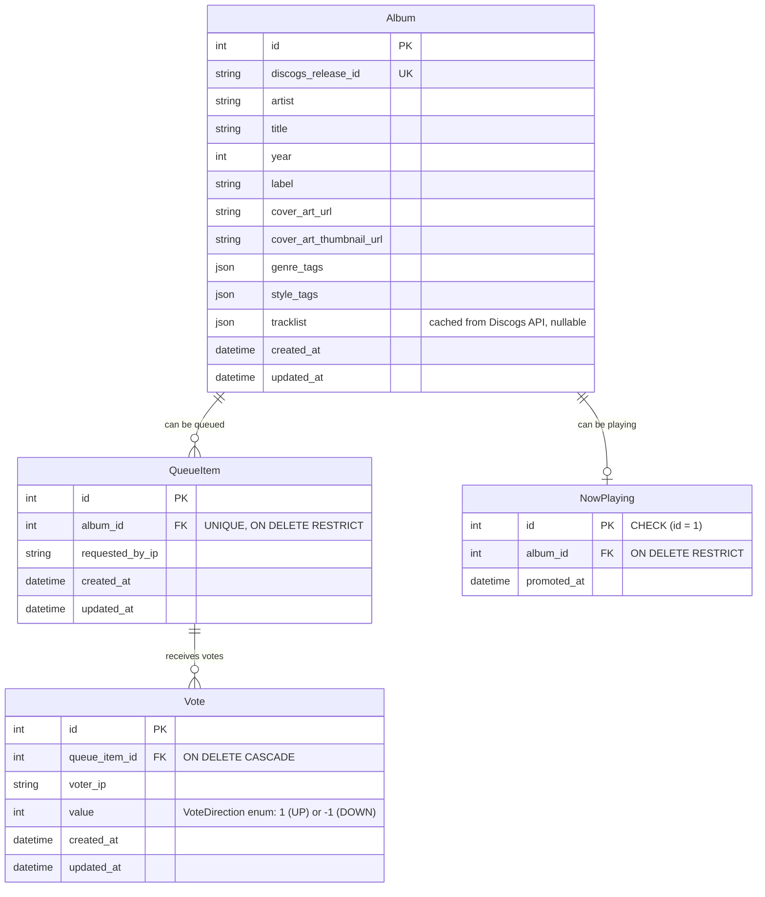

# feat: Vinyl Queue App — Full Implementation

## Enhancement Summary

**Deepened on:** 2026-03-25
**Review agents used:** architecture-strategist, security-sentinel, performance-oracle, data-integrity-guardian, julik-frontend-races-reviewer, kieran-python-reviewer, kieran-typescript-reviewer, code-simplicity-reviewer, pattern-recognition-specialist

### Key Improvements

1. **Data model hardened** — database-level constraints (unique album in queue, FK cascades, NowPlaying singleton enforcement), VoteDirection enum, `id`-based queue ordering replaces fragile `position` column
2. **Security gaps closed** — PIN rate limiting, IP extraction locked to `request.client.host`, CORS middleware, input validation with Pydantic constraints, custom header for host token
3. **Performance optimized** — server-side search always (no client-side fallback), `staleTime: Infinity` on SSE-driven queries, thumbnail URLs for grid, `loading="lazy"` on images, vote SSE debouncing
4. **Frontend race conditions addressed** — `visibilitychange` listener for SSE reconnection, mutation-in-flight SSE deferral strategy, button state derived from query cache, `my_vote` in queue API response
5. **Architecture clarified** — backend layering resolved (internal packages within `apps/backend`), service naming cleaned up (DiscogsClient vs SyncService), host token transport decided (custom header), route conflict fixed

### Simplicity Considerations

The code-simplicity reviewer flagged that 9 frontend libraries and 9 phases may be more ceremony than a dinner party app warrants. The current structure faithfully follows the project standards ("apps are thin shells, code lives in libs"). During implementation, if the overhead feels disproportionate, consider:
- Merging `data-access-collection` + `data-access-queue` + SSE client into a single `data-access` library
- Merging frontend feature phases (6-8) into a single frontend phase
- These are implementation-time optimizations, not plan changes — the standards are the standards

---

## Overview

Build "Cue the Music" — a local-network web app for dinner parties where guests browse a host's vinyl collection (synced from Discogs), request albums, and vote on a shared queue. The host controls the queue and what's playing via a PIN-activated host mode. Identity is IP-based. Real-time updates via SSE. No accounts, no login.

This plan covers the full greenfield build: NX monorepo scaffolding, backend API, database, Discogs integration, real-time broadcasting, and the complete frontend experience.

## Problem Statement

Dinner party hosts with vinyl collections have no easy way to let guests participate in the listening experience. Guests either shout requests across the room or hover over the host. Vinyl Queue gives guests agency over what's played while keeping the host in control of the turntable (see origin: `docs/brainstorms/2026-03-25-vinyl-queue-app-requirements.md`).

## Proposed Solution

A single-page, mobile-first React app backed by a FastAPI/SQLite server. Two-tab interface: "The Crate" for browsing and "Queue" for the live queue. Host mode overlays management controls on the same UI. SSE broadcasts state changes to all clients in real time. Discogs API provides collection data and tracklists.

## Technical Approach

### Architecture

```
┌─────────────────────────────────────────────────┐
│                  NX Monorepo                     │
│                                                  │
│  apps/frontend (thin shell)                      │
│    - main.tsx, App.tsx, routes                    │
│                                                  │
│  apps/backend                                    │
│    - main.py, app factory                        │
│    - Internal package structure:                 │
│      src/cue_the_music/                          │
│        routers/       thin endpoints             │
│        schemas/       Pydantic models            │
│        services/      business logic             │
│        repositories/  database queries           │
│        models/        SQLAlchemy models           │
│        events/        SSE broadcaster            │
│        integrations/  Discogs API client         │
│        dependencies/  FastAPI Depends() modules  │
│        exceptions/    custom exception classes   │
│                                                  │
│  libs/frontend/                                  │
│    core-types/        shared TS types            │
│    core-ui/           wrapped Ark UI components  │
│    core-theme/        Panda CSS config + tokens  │
│    data-access-collection/  TanStack Query hooks │
│    data-access-queue/       TanStack Query hooks │
│    data-access-host/        host mutations       │
│    feature-crate/     collection browse UI       │
│    feature-queue/     queue + voting UI          │
│    feature-host/      host mode controls         │
│    feature-sse/       SSE client + context       │
│                                                  │
└─────────────────────────────────────────────────┘
```

#### Research Insights: Architecture

**Backend structure decision:** `@nxlv/python` supports `--projectType=library` but backend libs add significant overhead for a single-API project. The backend uses an internal package structure within `apps/backend` with clear module boundaries. This is a documented exception to the "code lives in libs" standard — the Python backend's layered package structure (`routers/`, `services/`, `repositories/`) achieves the same separation without NX lib boilerplate.

**Frontend `feature-sse` dependency rule:** `feature-sse` may only import from `data-access-*` and `core-*` libraries. No feature-to-feature imports. It is an intentional cross-cutting coordination point that must be updated when new data domains are added.

**`data-access-host` library:** Added for host mutations (`useVerifyPin`, `usePromoteToNowPlaying`, `useTriggerSync`, etc.) per the standard: "Query and mutation definitions live in a dedicated data-access library per domain."

### Data Model (ERD)



**Design notes:**
- `NowPlaying` is a singleton table enforced at the database level with `CHECK (id = 1)`. Promotion uses upsert with fixed `id=1`: `INSERT ... ON CONFLICT(id) DO UPDATE SET album_id=?, promoted_at=?`. This makes the singleton invariant database-enforced, not application-enforced.
- `QueueItem.album_id` has a `UNIQUE` constraint at the database level — each album can only appear once in the queue. Simultaneous requests for the same album are handled by attempting the INSERT and catching `IntegrityError` (returns 409), NOT by check-then-insert (TOCTOU race).
- Queue ordering uses `QueueItem.id` (auto-incrementing) instead of a separate `position` column. Items display in `id` order, which is inherently insertion order. This eliminates the `max(position) + 1` race condition and simplifies the write path.
- `Vote.value` uses a `VoteDirection` enum (`class VoteDirection(int, Enum): UP = 1; DOWN = -1`) per backend standards: "Use Enum classes for any field with a fixed set of values." This flows through OpenAPI into generated frontend types.
- `Vote` has a `UNIQUE` constraint on `(queue_item_id, voter_ip)`. Vote upsert uses `INSERT ... ON CONFLICT DO UPDATE SET value=?` for atomic change.
- FK cascade rules: `Vote.queue_item_id ON DELETE CASCADE` (removing a queue item auto-deletes its votes), `QueueItem.album_id ON DELETE RESTRICT` and `NowPlaying.album_id ON DELETE RESTRICT` (prevent album deletion while queued or playing).
- `Album.cover_art_thumbnail_url` added for grid performance — Discogs provides multiple image sizes per release.
- `Album.tracklist` is nullable JSON — populated on first detail view, cached thereafter (see origin: R32).
- Queue and NowPlaying clear on server restart (acceptable per scope boundaries). Application truncates these tables on startup.
- `Album.genre_tags` and `Album.style_tags` are JSON arrays. Filtering uses SQLite `json_each()`.

#### Research Insights: Data Model

**Indexes (add in migrations):**
- `idx_queue_item_album_id` on `QueueItem.album_id` (FK lookup during request validation)
- `idx_queue_item_requested_by_ip` on `QueueItem.requested_by_ip` (3-request-limit check)
- `idx_vote_queue_item_id` on `Vote.queue_item_id` (vote aggregation)
- `idx_album_artist` on `Album.artist` (search)
- `idx_album_title` on `Album.title` (search)

**Transaction boundary for promote-to-NowPlaying:** Must be a single atomic transaction: (1) delete QueueItem (cascades to Votes), (2) upsert NowPlaying with fixed `id=1`, (3) commit. If step 2 fails after step 1, the album disappears from both queue and NowPlaying.

**Pydantic validation on Discogs responses:** Validate Discogs API responses with Pydantic models before persisting to JSON columns. Malformed JSON from a Discogs API bug would otherwise be stored silently.

### SSE Event Structure

Named event types for selective client-side listening:

| Event Type | Payload | Trigger |
|---|---|---|
| `queue_update` | Full queue state (items + vote counts + `my_vote` per item) | Request added, removed, cancelled, promoted |
| `vote_update` | `{ queue_item_id, up_count, down_count }` | Vote cast, changed, or removed |
| `collection_sync` | `{ status: "complete", album_count: N }` | Discogs sync finishes |
| `heartbeat` | `{}` | Every 30 seconds (keep-alive) |

**Client strategy:** SSE events trigger `queryClient.invalidateQueries()` with the appropriate key factory. Full state refetch on reconnect.

#### Research Insights: SSE

**Vote debouncing:** The broadcaster debounces `vote_update` events server-side — coalesces multiple vote changes within a 500ms window into a single broadcast. This caps the refetch storm at 2 events/second regardless of vote velocity. Without this, 20 guests actively voting triggers 20 x 20 = 400 refetch requests in seconds.

**`GET /api/queue` includes `my_vote`:** The queue response includes the requesting client's own vote state per queue item (`my_vote: 1 | -1 | null`), derived server-side from the request IP. This prevents vote UI flickering — the client always has authoritative state about its own vote after every refetch.

**`staleTime: Infinity` on SSE-driven queries:** Queue and now-playing queries set `staleTime: Infinity`. Freshness is managed exclusively by SSE invalidation. This prevents unnecessary refetches on component mounts, tab switches, and route transitions. Collection queries use `staleTime: 60000` (60s).

**`refetchOnWindowFocus: false` on SSE-driven queries only:** Applied per-query on queue-related queries, not globally. Collection queries retain default refetch behavior.

**Reconnection strategy:**
1. `document.visibilitychange` listener — on `visible`, check `EventSource` state and force reconnection if needed. Immediately invalidate all SSE-driven query keys regardless of connection state (phone may have been asleep for minutes).
2. Staleness timer — if no event (including heartbeat) received for 45 seconds, proactively tear down and reconnect. Do not trust `EventSource` to detect dead connections promptly.
3. On reconnect, refetch full state (not replay missed events).

**Connection limits:** Max 50 concurrent SSE connections globally, max 3 per IP. Per-client queue depth capped at 100 messages — exceeded clients are disconnected (they reconnect and refetch). Heartbeat writes detect dead connections; failed write triggers cleanup.

### Key Technical Decisions

| Decision | Choice | Rationale |
|---|---|---|
| Router | **TanStack Router** | Standards doc describes its patterns explicitly. CLAUDE.md to be updated as pre-work. |
| SSE library | **sse-starlette** | Standards-compliant, handles disconnect detection, supports named event types |
| SSE broadcast | Queue-per-client singleton broadcaster | Simple, in-memory, sufficient for local-network single-process |
| Frontend SSE integration | Invalidation strategy (not direct cache update) | Simpler, decoupled from cache shape, negligible latency on local network |
| SQLite mode | **WAL** + `busy_timeout=5000` + `synchronous=NORMAL` | Concurrent reads during writes, 5s retry on write contention, safe with WAL |
| Async driver | **aiosqlite** with `expire_on_commit=False` | Required for async FastAPI + SQLAlchemy 2.0 |
| Discogs throttling | `aiolimiter` at 50 req/min (global, shared across sync + tracklist fetches) | Headroom below 60 req/min limit |
| Sync strategy | Upsert only (no deletions) | Avoids orphaning queued albums during a party |
| Host token transport | **Custom header (`X-Host-Token`)** | Aligns with Zustand store design; avoids cookie CORS/SameSite complexity; eliminates CSRF risk |
| Host mode persistence | Session storage via Zustand `persist` middleware | Survives page refresh, clears on tab close |
| Queue ordering | `QueueItem.id` (auto-increment) | Eliminates position race condition; insertion order is inherent |
| Search/filter | Always server-side | Simpler (one code path), fast on local network (<5ms round-trip), properly indexed |

### API Endpoints

```
# Collection
GET    /api/albums                    # list albums (with search + filter query params)
GET    /api/albums/:id                # album detail (triggers tracklist cache if needed)
GET    /api/album-filters             # available genre + decade values for chips

# Queue
GET    /api/queue                     # full queue state (now playing + up next + votes + my_vote per item)
POST   /api/queue                     # request an album (body: { album_id })
DELETE /api/queue/:id                 # cancel own request (enforced by IP)

# Votes
PUT    /api/queue/:id/vote            # cast or change vote (body: { value: 1|-1 })
DELETE /api/queue/:id/vote            # remove vote

# Host (protected by X-Host-Token header)
POST   /api/host/verify-pin           # verify PIN (body: { pin })
POST   /api/host/now-playing          # promote queue item (body: { queue_item_id })
DELETE /api/host/now-playing           # clear now playing
DELETE /api/host/queue/:id            # skip/remove any queue item
POST   /api/host/sync                 # trigger Discogs sync

# SSE
GET    /api/events                    # SSE stream
```

#### Research Insights: API

**Route conflict fixed:** Renamed `/api/albums/filters` to `/api/album-filters` to avoid collision with `/api/albums/:id` (FastAPI would match "filters" as an `:id` parameter depending on route registration order).

**IP extraction:** All endpoints extract client IP from `request.client.host` — **never from `X-Forwarded-For` or other proxy headers**. Since this is a local network app with no reverse proxy, trusting forwarded headers would allow trivial IP spoofing (unlimited requests, multiple votes, cancelling others' requests).

**Host endpoints:** Protected by a `Depends()` that reads `X-Host-Token` from the request header, validates against the server-side in-memory token store. The Zustand host store holds the token and the data-access layer attaches it to requests via a fetch interceptor.

**Dual deletion paths:** `DELETE /api/queue/:id` (guest, IP-checked) and `DELETE /api/host/queue/:id` (host, token-checked) are separate routes by design — cleanly separates authorization at the routing level.

### Custom Exception Classes

| Exception | HTTP Status | Trigger |
|---|---|---|
| `AlbumNotFoundError` | 404 | Album ID doesn't exist |
| `QueueItemNotFoundError` | 404 | Queue item ID doesn't exist |
| `AlbumAlreadyQueuedError` | 409 | Album is already in the queue |
| `RequestLimitExceededError` | 429 | Guest has 3 active requests |
| `VoteNotFoundError` | 404 | Vote doesn't exist (on remove) |
| `InvalidHostPinError` | 401 | Wrong PIN |
| `UnauthorizedHostActionError` | 403 | Missing or invalid host token |
| `DiscogsSyncError` | 502 | Discogs API failure during sync |
| `DiscogsRateLimitError` | 429 | Discogs rate limit hit |

All exceptions carry a user-friendly `message` field. The global exception handler maps each to its HTTP status and returns a consistent JSON error shape for the frontend.

## System-Wide Impact

### Interaction Graph

- **Guest requests album** -> `POST /api/queue` -> QueueService validates (album exists, not already queued, guest under 3-request limit) -> QueueRepository attempts INSERT (catches IntegrityError for 409) -> Broadcaster emits `queue_update` -> All clients invalidate queue queries
- **Guest votes** -> `PUT /api/queue/:id/vote` -> QueueService upserts vote (ON CONFLICT DO UPDATE) -> Broadcaster debounces + emits `vote_update` -> All clients invalidate queue queries
- **Host promotes to Now Playing** -> `POST /api/host/now-playing` -> QueueService in single transaction: delete QueueItem (cascades votes) + upsert NowPlaying(id=1) -> Broadcaster emits `queue_update` -> All clients invalidate
- **Host triggers sync** -> `POST /api/host/sync` -> SyncService fetches pages via DiscogsClient (rate-limited) -> AlbumRepository upserts per page -> `asyncio.sleep(0)` between pages for event loop responsiveness -> On completion, Broadcaster emits `collection_sync` -> All clients invalidate collection queries

### Error Propagation

- **Discogs API errors** (rate limit, timeout, auth failure) -> DiscogsClient raises typed exceptions -> SyncService catches, logs, returns partial result to host -> Host sees friendly error toast
- **SQLite busy** -> SQLAlchemy retries up to `busy_timeout` (5s) -> If exceeded, raises `OperationalError` -> Service layer catches and returns 503
- **SSE disconnect** -> Client detects via staleness timer (45s no events) or `visibilitychange` -> Reconnects and refetches full state

### State Lifecycle Risks

- **Partial sync failure:** Committing per page ensures partial progress is preserved. Host sees friendly error on failure.
- **Vote on removed item:** Server returns 404. Client handles gracefully — SSE update arrives to remove the item. The 409/404 responses are not errors from the user's perspective — they are information.
- **Simultaneous Now Playing promotion:** Last write wins (upsert on `id=1`). SSE broadcasts the final state.
- **Album requested while another guest has overlay open:** Second guest gets 409, button transitions to "Already in queue" (not an error toast). SSE update confirms.

### API Surface Parity

All guest and host actions have corresponding REST endpoints. No action is UI-only. The SSE stream is the only non-REST interface.

### Integration Test Scenarios

1. **Two guests request the same album simultaneously** — only one succeeds (unique constraint on `album_id`), the other gets a 409.
2. **Guest votes on album, host removes album before vote response** — vote returns 404 (or FK violation caught as 404). SSE removes album from client.
3. **Discogs sync while guests are browsing** — collection queries return stale data until sync completes and SSE triggers invalidation. No errors for guests.
4. **Host promotes album to Now Playing while guest is voting on it** — single-transaction promotion removes item + cascades votes. Late vote returns 404. SSE reconciles.
5. **SSE client reconnects after phone sleep** — `visibilitychange` triggers reconnection + full state refetch.

## Implementation Phases

### Phase 1: Foundation — NX Monorepo + Database + Core Backend

**Goal:** Scaffolded monorepo with working backend, database, and collection CRUD.

**Tasks:**

- [ ] **Pre-work:** Update CLAUDE.md: change "React Router" to "TanStack Router" (do this before any implementation)
- [ ] Initialize NX 22 workspace with `@nx/react` and `@nxlv/python` plugins
- [ ] Generate `apps/frontend` via `@nx/react:application` (Vite 7)
- [ ] Generate `apps/backend` via `@nxlv/python:uv-project` (Python 3.13, FastAPI, ruff, pytest, `--pyprojectPythonDependency=">=3.13,<3.14"`)
- [ ] Configure Panda CSS in the frontend app (`panda.config.ts` with "Digital Neon Tactility" theme tokens from `docs/wireframes/electric_record_shop/DESIGN.md`)
- [ ] Configure TanStack Router with file-based routing, route-level error boundaries and pending states on all routes
- [ ] Set up SQLAlchemy 2.0 async engine with aiosqlite:
  - WAL mode, `busy_timeout=5000`, `synchronous=NORMAL`, `foreign_keys=ON`, `cache_size=-64000`, `temp_store=MEMORY`
  - PRAGMAs set via `@event.listens_for(engine.sync_engine, "connect")` event listener
  - `expire_on_commit=False` on async session factory (required to avoid lazy-load errors after commit in async context)
  - Explicit transaction control: `isolation_level=None` on connection, `BEGIN` via engine event
- [ ] Define shared `Base` model class with `TimestampMixin` (created_at, updated_at) using `Mapped[]` type annotations (SQLAlchemy 2.0 declarative style)
- [ ] Create `Album` model (`models/album.py`) with `cover_art_thumbnail_url` field
- [ ] Create Alembic migration for `Album` table with indexes on `artist`, `title`, `year`
- [ ] Create `AlbumRepository` (class-based, injected via `Depends()` factory) with search/filter queries (server-side, using SQLite `json_each()` for genre/style filtering)
- [ ] Create `AlbumService` with business logic
- [ ] Create Pydantic schemas: `AlbumGetResponse`, `AlbumListResponse`, `AlbumFilterGetResponse`
- [ ] Create album router: `GET /api/albums`, `GET /api/albums/:id`, `GET /api/album-filters`
- [ ] Set up FastAPI dependency injection for database sessions (`dependencies/database.py`)
- [ ] Configure FastAPI CORS middleware (allow origins: `http://localhost:5173`, `http://<host-machine-ip>:5173`)
- [ ] Create custom exception classes (`exceptions/`) and global error handler middleware
- [ ] Add `.env` to `.gitignore`, create `.env.example`
- [ ] Generate frontend libraries: `core-types`, `core-ui`, `core-theme`
- [ ] Set up OpenAPI type generation pipeline (e.g., `openapi-typescript`) to generate frontend types from FastAPI schema
- [ ] Update CLAUDE.md: populate Architecture Notes and Commands sections
- [ ] Update `docs/cue-the-music-overview.md`: change "one active request" to "up to three active requests", change "tracklist not stored locally" to "tracklist cached after first fetch"
- [ ] Write tests: album repository, album service, album endpoints

**Success criteria:**
- `nx serve backend` starts the API server
- `nx serve frontend` starts the dev server
- Album CRUD endpoints return proper Pydantic responses
- Database migrations run cleanly with indexes
- Panda CSS theme tokens match the design system
- CORS allows frontend-to-backend communication

### Phase 2: Discogs Integration

**Goal:** Host can sync their Discogs collection into the local database.

**Tasks:**

- [ ] Create Discogs API client (`integrations/discogs_client.py`) with:
  - Authentication via user token (from env/config, validated at startup with fail-fast)
  - Collection fetch with pagination
  - Release detail fetch (for tracklists)
  - Rate limiter (`aiolimiter` at 50 req/min) — **global** limiter shared across sync + tracklist fetches
  - Custom User-Agent header: `CueTheMusic/1.0`
  - Pydantic validation on all Discogs API responses before persisting
  - Never log the API token value; log only "Discogs auth: configured/missing"
  - Store both `cover_art_url` (full size) and `cover_art_thumbnail_url` (150x150) from Discogs response
- [ ] Create `SyncService` (`services/sync_service.py`) with:
  - Page-by-page fetch via DiscogsClient with per-page commits
  - Upsert logic (update existing albums by `discogs_release_id`, insert new ones)
  - No deletion of albums removed from Discogs (additive only)
  - `asyncio.sleep(0)` between pages for event loop responsiveness during long syncs
  - Progress tracking for host feedback
- [ ] Create Pydantic schemas: `CollectionSyncTriggerResponse`, `CollectionSyncStatusResponse`
- [ ] Create host router: `POST /api/host/sync`
- [ ] Add tracklist caching to `AlbumService.get_album_detail()` — orchestrates: check `Album.tracklist`, if null call DiscogsClient to fetch, store in `Album.tracklist` JSON column via AlbumRepository
- [ ] Configure Discogs token via `.env` file (`DISCOGS_TOKEN`, `DISCOGS_USERNAME`)
- [ ] Write tests: DiscogsClient (mocked API), SyncService, tracklist caching

**Success criteria:**
- Sync imports a real Discogs collection into SQLite
- Tracklists are fetched on first album detail view and cached
- Rate limiting prevents exceeding 60 req/min
- Partial sync failure preserves already-synced albums
- Thumbnail URLs stored for grid performance

### Phase 3: Queue + Voting + Now Playing

**Goal:** Full queue lifecycle — request, vote, cancel, promote, skip.

**Tasks:**

- [ ] Create `VoteDirection` enum (`class VoteDirection(int, Enum): UP = 1; DOWN = -1`)
- [ ] Create `QueueItem` model (`models/queue_item.py`) with `UNIQUE` constraint on `album_id`, FK `ON DELETE RESTRICT`
- [ ] Create `Vote` model (`models/vote.py`) with `VoteDirection` value, `UNIQUE` on `(queue_item_id, voter_ip)`, FK `ON DELETE CASCADE`
- [ ] Create `NowPlaying` model (`models/now_playing.py`) with `CHECK (id = 1)` constraint, FK `ON DELETE RESTRICT`
- [ ] Create Alembic migrations with indexes on `QueueItem.album_id`, `QueueItem.requested_by_ip`, `Vote.queue_item_id`
- [ ] Create `QueueRepository` (class-based with `Depends()` factory):
  - Insert: attempt INSERT, catch `IntegrityError` for duplicate album (409) — NOT check-then-insert
  - Delete by ID with IP ownership check for guest cancellation
  - Get full queue state: items ordered by `id`, with vote aggregates + `my_vote` per item (filtered by requesting IP)
  - Count active requests per IP
- [ ] Create `VoteRepository`:
  - Upsert vote: `INSERT ... ON CONFLICT(queue_item_id, voter_ip) DO UPDATE SET value=?`
  - Delete vote
  - Aggregate vote counts per queue item
- [ ] Create `NowPlayingRepository`:
  - Upsert with fixed `id=1`: `INSERT ... ON CONFLICT(id) DO UPDATE SET album_id=?, promoted_at=?`
  - Get current
  - Clear (DELETE)
- [ ] Create `QueueService` with business logic (handles queue requests, votes, and now-playing promotion):
  - Request validation (album exists, not in queue, guest under 3-request limit)
  - Cancel validation (IP ownership)
  - Promote to Now Playing: **single transaction** — delete QueueItem (cascades votes) + upsert NowPlaying(id=1) + commit
  - Skip/remove (host only)
  - Vote cast/change/remove
- [ ] Create Pydantic schemas with explicit validation:
  - `QueueItemCreateRequest` (`album_id: int = Field(gt=0)`)
  - `QueueItemGetResponse`, `QueueStateResponse` (includes `my_vote: VoteDirection | None` per item)
  - `VoteCastRequest` (`value: Literal[1, -1]` or `VoteDirection`)
  - `VoteGetResponse`
  - `NowPlayingGetResponse`, `QueueItemPromoteRequest` (`queue_item_id: int = Field(gt=0)`)
- [ ] Create queue router: `GET /api/queue`, `POST /api/queue`, `DELETE /api/queue/:id`
- [ ] Create vote router: `PUT /api/queue/:id/vote`, `DELETE /api/queue/:id/vote`
- [ ] Create host queue router: `POST /api/host/now-playing`, `DELETE /api/host/now-playing`, `DELETE /api/host/queue/:id`
- [ ] Add startup hook to truncate `QueueItem`, `Vote`, and `NowPlaying` tables (queue clears on restart)
- [ ] Write tests: queue repository, vote repository, queue service (including race conditions and transaction tests), all endpoints

**Success criteria:**
- Guests can request, cancel, and vote
- 3-request limit enforced per IP
- Album uniqueness in queue enforced at database level
- Vote upsert (change vote) works correctly with `ON CONFLICT DO UPDATE`
- Host can promote (single atomic transaction), skip, remove
- NowPlaying singleton enforced with CHECK constraint
- 409 on duplicate album, not TOCTOU race

### Phase 4: Host Authentication + SSE

**Goal:** PIN-based host mode and real-time broadcasting.

**Tasks:**

- [ ] Create host PIN verification endpoint: `POST /api/host/verify-pin`
  - PIN from server config (env var `HOST_PIN`)
  - Validate PIN input: `Field(min_length=4, max_length=4, pattern=r"^\d{4}$")`
  - Rate limiting: 5 attempts per IP per minute + 500ms response delay on every attempt
  - Returns a session token generated with `secrets.token_urlsafe(32)` (256 bits of entropy)
  - Token stored server-side in-memory with 4-hour expiry, limited to one active host session (last verify wins)
  - Server restart invalidates all host sessions (documented known behavior)
- [ ] Create host auth dependency (`dependencies/host_auth.py`) that validates `X-Host-Token` custom header
  - Protects all `/api/host/*` endpoints except `verify-pin`
- [ ] Create SSE broadcaster (created in FastAPI lifespan handler, stored on `app.state`, injected via `Depends()`):
  - Singleton `MessageBroadcaster` with queue-per-client pattern
  - `add_client()`, `remove_client()`, `broadcast(event_type, data)` methods
  - Server-side debouncing: coalesce `vote_update` events within 500ms window
  - 30-second heartbeat as `asyncio.Task` started in lifespan startup, cancelled in shutdown
  - Client disconnect detection via `request.is_disconnected()` on every heartbeat write
  - Send timeout (30s) for stalled connections
  - Max 50 concurrent connections globally, max 3 per IP
  - Per-client queue depth capped at 100 messages; exceeded clients disconnected
- [ ] Create SSE endpoint: `GET /api/events` returning `EventSourceResponse`
- [ ] Integrate broadcaster into QueueService:
  - Broadcast `queue_update` on add/remove/cancel/promote
  - Broadcast `vote_update` (debounced) on vote cast/change/remove
  - Broadcast `collection_sync` on sync complete
- [ ] Write tests: PIN verification (including rate limiting), host auth dependency, SSE broadcast (integration test with test client)

**Success criteria:**
- PIN verification issues a session token with rate limiting
- Host endpoints reject requests without valid `X-Host-Token` header
- SSE stream delivers named events to connected clients
- Vote events are debounced server-side
- Heartbeat keeps connections alive and detects dead clients
- Connection limits enforced

### Phase 5: Frontend — Core UI Components + Theme

**Goal:** Design system implemented, core wrapped Ark UI components ready.

**Tasks:**

- [ ] Generate `libs/frontend/core-theme` — Panda CSS configuration:
  - Color tokens from DESIGN.md: surface (`#0e0e0e`), primary (Electric Lime `#f3ffca` / `#cafd00`), secondary (Hot Pink `#ff6b9b` / `#ba005b`), tertiary (Cyan `#a1faff` / `#00f4fe`)
  - Typography tokens: Space Grotesk (display/headline), Manrope (body/label)
  - Spacing scale, border radius (`xl` for cards, `full` for pills)
  - Shadow tokens (ambient shadows, neon glow)
  - Glass/gradient tokens (60% opacity + 20px backdrop blur)
- [ ] Generate `libs/frontend/core-ui` — wrapped Ark UI components (each with full folder anatomy: `index.ts`, component, hook, types, elements):
  - `Dialog` — for album detail overlay (slot recipe: backdrop, positioner, content, title, description, closeTrigger)
  - `Tabs` — for bottom navigation (slot recipe: root, list, trigger, content)
  - `PinInput` — for host PIN entry (slot recipe matching keypad wireframe)
  - `Menu` — for host action menus on queue items
  - `Toast` — for notifications (album requested, sync complete, errors)
  - `ToggleGroup` — for vote up/down controls
- [ ] Create shared UI components (same component anatomy as Ark UI wrappers):
  - `AlbumCard` — 2-column grid card (cover art with `loading="lazy"` and `aspect-ratio: 1`, title, artist, year). Uses `cover_art_thumbnail_url` for grid, not full-size.
  - `ChipFilter` — genre/decade filter chip (multi-select)
  - `VoteControls` — thumb up/down with counts, derives state from `my_vote` in query response
  - `NowPlayingCard` — prominent Now Playing display with album cover (full size)
  - `EmptyState` — reusable empty state with icon + message
  - `SearchInput` — debounced text input (300ms)
- [ ] Implement design system rules: no 1px borders, ambient shadows, gradient CTAs, scale-to-0.98 press animation on cards

**Success criteria:**
- All components (Ark UI wrappers AND shared) follow full folder anatomy (hook, types, elements)
- Panda CSS theme tokens match DESIGN.md exactly
- Components render correctly against wireframes
- No magic numbers, no inline styles, no `styled()`
- Cover art images use `loading="lazy"` and explicit dimensions

### Phase 6: Frontend — The Crate (Collection Browse)

**Goal:** Guests can browse, search, and filter the album collection.

**Tasks:**

- [ ] Generate `libs/frontend/data-access-collection` — TanStack Query hooks:
  - `albumKeys` query key factory
  - `useAlbums(filters)` — `useSuspenseQuery`, server-side search + genre + decade filters
  - `useAlbum(id)` — `useSuspenseQuery` with `placeholderData` (show cached data while refetching, avoids Suspense flash during sync)
  - `useAlbumFilters()` — available genre + decade values
  - `staleTime: 60000` (60s) for collection queries
- [ ] Generate `libs/frontend/feature-crate`:
  - `CrateView` — main collection browse view
  - `AlbumGrid` — 2-column responsive grid of `AlbumCard` components (consider `@tanstack/react-virtual` if collection >500 albums causes jank during testing)
  - `AlbumDetailOverlay` — Dialog-based overlay with album detail + "Request This Album" button. **Anchored to stable album ID** (route search param or Zustand), not derived from grid render state.
  - `CollectionSearch` — search input + chip filters
- [ ] Implement search: always server-side with 300ms debounce. "No results" shows empty state echoing search term.
- [ ] Implement genre/decade chip filters: multi-select within each category, populated from `useAlbumFilters()`
- [ ] Implement album detail overlay:
  - Cover art (full size), label, title, artist, year, genre/style chips
  - Tracklist with loading skeleton (fetched on open, cached)
  - "Request This Album" button — **state derived from query cache, not local component state**
  - Button disabled with "Already in queue" (from queue data) or "Request limit reached" feedback
  - Overlay stays open after requesting; button transitions to "Requested" disabled state via mutation `isPending` -> disabled with spinner, then cache update confirms
  - On 409 response: transition button to "Already in queue" (not an error toast — someone beat them to it)
- [ ] Implement empty state: "No albums yet. The host hasn't synced their collection."
- [ ] Add TanStack Router route loaders with `ensureQueryData` for collection data pre-fetching
- [ ] Write tests: data-access hooks (mocked), CrateView rendering, search/filter behavior, overlay interactions, 409 handling

**Success criteria:**
- Albums display in a 2-column grid matching wireframe using thumbnail images
- Search filters server-side by artist/title with debounce
- Genre + decade chips filter the grid (multi-select)
- Album detail overlay shows tracklist (with loading/error states), uses `placeholderData` to avoid flash
- Request button state derived from query cache; handles 409 gracefully
- Empty collection state is handled gracefully

### Phase 7: Frontend — Queue + Voting

**Goal:** Guests see the live queue, vote, and cancel their requests.

**Tasks:**

- [ ] Generate `libs/frontend/data-access-queue` — TanStack Query hooks:
  - `queueKeys` query key factory
  - `useQueue()` — `useSuspenseQuery`, full queue state (now playing + up next + votes + `my_vote`), `staleTime: Infinity`, `refetchOnWindowFocus: false`
  - `useRequestAlbum()` — mutation with `onSuccess` invalidation of `queueKeys.all`, `onError` handler for 409 (already queued) and 429 (limit reached)
  - `useCancelRequest()` — mutation with `onSuccess` invalidation
  - `useVote()` — mutation with `onSuccess` invalidation
- [ ] Generate `libs/frontend/feature-queue`:
  - `QueueView` — main queue view
  - `NowPlayingSection` — Now Playing slot with album cover art (full size), title, artist
  - `UpNextList` — ordered list of queue items with vote controls and queue count
  - `QueueItem` — single queue item (composes `AlbumCard` for album info, adds vote buttons, cancel button if own request based on `my_vote` / IP match)
- [ ] Generate `libs/frontend/feature-sse` — SSE client:
  - `SSEProvider` React context at app root — single `EventSource` connection
  - On `queue_update`: invalidate `queueKeys.all`
  - On `vote_update`: invalidate `queueKeys.all`
  - On `collection_sync`: invalidate `albumKeys.all`
  - **Mutation-in-flight deferral:** Maintain a set of in-flight mutation query key prefixes. SSE handler defers invalidation for those keys until the mutation settles. Prevents the "blink" where a refetch arrives without the user's pending change.
  - `visibilitychange` listener: on `visible`, force reconnection if needed + invalidate all SSE-driven keys
  - Staleness timer: if no event received for 45s, tear down and reconnect
  - `feature-sse` imports only from `data-access-*` and `core-*` libraries (no feature-to-feature imports)
- [ ] Implement guest queue interactions:
  - Vote up/down — changeable, own vote state highlighted from `my_vote` in response
  - Cancel own request — cancel button shown only on items where `my_vote` context (IP match via server response) indicates ownership
  - Guests see up and down vote counts on all items
- [ ] Implement empty states:
  - No Now Playing: "Nothing playing yet" with muted placeholder
  - Empty queue: "No requests yet. Browse The Crate and request an album."
- [ ] Wire up bottom navigation (Tabs component): The Crate and Queue tabs
- [ ] Write tests: data-access hooks, QueueView rendering, vote interactions, SSE integration (mocked EventSource), mutation-in-flight deferral, empty states, reconnection

**Success criteria:**
- Queue updates in real time for all connected clients
- Votes work correctly (cast, change, remove) with no flickering
- Guest's own requests show cancel button (derived from server response)
- Empty states render appropriately
- SSE reconnection via `visibilitychange` + staleness timer
- Mutations don't "blink" due to SSE invalidation during in-flight requests

### Phase 8: Frontend — Host Mode

**Goal:** Host can activate host mode and manage the queue.

**Tasks:**

- [ ] Generate `libs/frontend/data-access-host` — TanStack Query hooks:
  - `useVerifyPin()` — mutation, stores token in Zustand on success
  - `usePromoteToNowPlaying()` — mutation with `onSuccess` invalidation
  - `useClearNowPlaying()` — mutation
  - `useRemoveQueueItem()` — mutation
  - `useTriggerSync()` — mutation
  - All host mutations attach `X-Host-Token` header from Zustand store via fetch interceptor
- [ ] Generate `libs/frontend/feature-host`:
  - `HostPinOverlay` — PIN entry keypad using wrapped PinInput component
  - `HostModeIndicator` — "HOST MODE ACTIVE" indicator with green dot
  - `HostQueueControls` — inline controls on queue items (promote to Now Playing, skip/remove)
  - `SyncButton` — "Discogs Sync" button with loading state
- [ ] Create host mode Zustand store (`useHostStore`):
  - `isHostMode: boolean`
  - `sessionToken: string | null`
  - `activateHostMode(token)` / `deactivateHostMode()` actions
  - Persist to session storage via Zustand `persist` middleware with `createJSONStorage(() => sessionStorage)`
- [ ] Implement PIN entry:
  - 4-digit numeric keypad overlay (matches wireframe)
  - Triggered by lock icon in header
  - On correct PIN: store session token, close overlay, show host controls
  - On incorrect PIN: shake animation, clear input, allow retry
- [ ] Implement host queue controls:
  - "Play" button on queue items to promote to Now Playing
  - "Remove" button on queue items to skip/remove
  - Down-vote counts prominently highlighted as skip signals
  - Promote immediately replaces current Now Playing (no confirmation needed)
- [ ] Implement Discogs sync from host mode:
  - Sync button on queue view with loading state during sync
  - Success/failure toast on completion
- [ ] Implement host mode deactivation
- [ ] Write tests: PIN entry flow, host mode store, host queue controls, sync trigger

**Success criteria:**
- PIN entry works per wireframe (4-digit keypad, no forgot PIN)
- Host controls appear inline on queue items when host mode is active
- Promote, skip, remove actions work and broadcast via SSE
- Host mode persists across page refresh (session storage)
- Deactivation hides all host controls
- `X-Host-Token` header attached to all host requests

### Phase 9: Polish + E2E Tests

**Goal:** Production-ready quality, full test coverage, design fidelity.

**Tasks:**

- [ ] Implement Playwright E2E tests:
  - Full guest flow: browse collection, open album detail, request album, view queue, vote
  - Full host flow: enter PIN, promote to Now Playing, skip, trigger sync
  - Multi-client SSE: verify real-time updates across multiple browser contexts
  - Edge cases: request limit, duplicate album in queue (409 handling), vote on removed item
  - PIN rate limiting
- [ ] Design fidelity pass against wireframes:
  - Verify against all four wireframe screenshots
  - Implement "Digital Neon Tactility" design details: ambient shadows, neon glow, gradient CTAs, glass effect, press animations
  - Mobile responsiveness on various phone sizes
- [ ] Error handling pass:
  - Friendly error messages for all failure scenarios (via custom exceptions)
  - Tracklist fetch failure: "Tracklist unavailable"
  - Network errors: toast notification
  - 409 on request: "Already in queue" (not error)
- [ ] Accessibility pass:
  - Keyboard navigation for all interactive elements
  - Screen reader support via Ark UI's built-in ARIA
  - Sufficient color contrast (check neon-on-dark combinations)
- [ ] Performance pass:
  - Evaluate album grid performance at 500+ albums; add `@tanstack/react-virtual` if needed
  - Verify `loading="lazy"` and thumbnail URLs working for grid images
  - SSE connection stability under 20+ simultaneous clients
- [ ] Populate CLAUDE.md Commands section with dev commands (`nx serve frontend`, `nx serve backend`, `nx test`, etc.)
- [ ] Achieve 90%+ code coverage across backend and frontend

**Success criteria:**
- All E2E tests pass
- UI matches wireframes
- No technical errors visible to users
- 90%+ code coverage
- App handles 500+ albums and 20+ simultaneous guests

## Acceptance Criteria

### Functional Requirements

From the requirements doc (see origin: `docs/brainstorms/2026-03-25-vinyl-queue-app-requirements.md`):

- [ ] R1. Two-tab bottom nav: The Crate + Queue
- [ ] R2. Guests land on The Crate by default
- [ ] R3. Host controls appear inline on Queue when activated
- [ ] R4. Text search at top of The Crate (artist/album)
- [ ] R5. Genre + decade chip filters (multi-select, populated from collection data)
- [ ] R6. 2-column album card grid (cover art, title, artist, year)
- [ ] R7. Album detail overlay (cover art, label, title, artist, year, chips, tracklist, request button)
- [ ] R8. Request button disabled when album in queue or guest at 3-request limit
- [ ] R9. Now Playing slot with album cover art, title, artist
- [ ] R10. Up Next list in insertion order with queue count
- [ ] R11. Votes do not reorder queue
- [ ] R12. Album uniqueness in queue (one at a time)
- [ ] R13. Real-time updates via SSE
- [ ] R14. IP-based identity
- [ ] R15. Up to 3 active requests per guest
- [ ] R16. Guests can cancel own pending requests
- [ ] R17. One vote per guest per album (up or down)
- [ ] R18. Votes changeable (switch up/down/remove)
- [ ] R19. Anonymous feel (no "logged in as" language)
- [ ] R20-R22. 4-digit PIN keypad, no forgot PIN
- [ ] R23. HOST MODE ACTIVE indicator + inline controls
- [ ] R24. Promote to Now Playing (immediate replacement)
- [ ] R25. Skip/remove any album from queue
- [ ] R26. Down-vote counts highlighted as skip signals for host
- [ ] R27. Trigger Discogs sync from queue view
- [ ] R28. Deactivate host mode
- [ ] R29-R31. Discogs sync with upsert
- [ ] R32. Tracklist cached after first fetch
- [ ] R33. Cover art by URL (not downloaded)
- [ ] R34. Silent background refresh after sync
- [ ] R35-R37. SSE for queue, votes, and collection sync

### Non-Functional Requirements

- [ ] 90%+ code coverage
- [ ] All design values from Panda CSS tokens (no magic numbers)
- [ ] Mobile-first responsive design
- [ ] Friendly error messages only (no technical errors visible to users)
- [ ] All Ark UI components wrapped per standards
- [ ] Apps are thin shells — all meaningful code in libs (backend exception documented)
- [ ] Backend layering: router -> service -> repository
- [ ] Named exports only, alphabetized ordering throughout
- [ ] SQLAlchemy 2.0 declarative style with `Mapped[]` type annotations
- [ ] `useSuspenseQuery` as default, `useQuery` only when Suspense doesn't fit

### Quality Gates

- [ ] All Playwright E2E tests pass
- [ ] All unit/integration tests pass
- [ ] Ruff lint clean (backend)
- [ ] ESLint + Prettier clean (frontend)
- [ ] No `any` in TypeScript, no untyped Python signatures
- [ ] UI matches wireframes
- [ ] Database constraints enforced (unique album in queue, FK cascades, NowPlaying singleton CHECK)

## Success Metrics

- Guests can browse, search, request, and vote within 5 seconds of connecting
- Queue updates appear on all clients within 1 second of state change
- 500+ album collection syncs and is browsable without noticeable lag
- Host can manage full queue lifecycle from phone

## Dependencies & Prerequisites

- NX 22 with `@nx/react` and `@nxlv/python` plugins
- Discogs account with collection + API token
- Python 3.13, Node.js (current LTS)
- Google Fonts: Space Grotesk, Manrope

## Risk Analysis & Mitigation

| Risk | Impact | Likelihood | Mitigation |
|---|---|---|---|
| Discogs API rate limiting during party | Tracklist fetches fail | Medium | Global `aiolimiter` at 50 req/min + database-cached tracklists |
| SQLite write contention with many votes | Slow responses | Low | WAL mode + `busy_timeout=5000` + `synchronous=NORMAL`; 10-20 guests well within capacity |
| SSE connections dropped by mobile browsers | Stale queue state | Medium | `visibilitychange` listener + staleness timer + full state refetch on reconnect |
| @nxlv/python compatibility issues with NX 22 | Build/scaffold failures | Medium | Plugin is v22.1.1; fall back to manual Python project if needed |
| Large collections (1000+ albums) | Slow grid rendering | Low | Thumbnail URLs for grid + `loading="lazy"` + virtual scrolling if needed in Phase 9 |
| PIN brute force by curious guest | Unauthorized host access | Medium | Rate limiting (5 attempts/IP/min) + 500ms response delay |
| IP spoofing via X-Forwarded-For | Bypass request/vote limits | Low | Use `request.client.host` only; never trust forwarded headers |

## Documentation Plan

- [ ] Update CLAUDE.md: router change (pre-work), architecture notes, dev commands
- [ ] Update `docs/cue-the-music-overview.md`: request limit (1 -> 3), tracklist caching
- [ ] Populate `.env.example` with required config vars (`DISCOGS_TOKEN`, `DISCOGS_USERNAME`, `HOST_PIN`)
- [ ] Ensure `.env` in `.gitignore`

## Sources & References

### Origin

- **Origin document:** [docs/brainstorms/2026-03-25-vinyl-queue-app-requirements.md](docs/brainstorms/2026-03-25-vinyl-queue-app-requirements.md) — Key decisions carried forward: Now Playing as explicit state, 3 requests per guest, changeable votes, tracklist caching, silent sync refresh, album cover art in Now Playing.

### Internal References

- Standards: `docs/standards/STANDARDS-general.md`, `STANDARDS-frontend.md`, `STANDARDS-backend.md`
- Design system: `docs/wireframes/electric_record_shop/DESIGN.md`
- Wireframes: `docs/wireframes/*/screen.png`

### External References

- [sse-starlette](https://github.com/sysid/sse-starlette) — SSE for FastAPI
- [Discogs API docs](https://www.discogs.com/developers) — 60 req/min authenticated
- [Ark UI React](https://ark-ui.com/) — unstyled component library (v5.34.1)
- [Park UI](https://park-ui.com) — reference Panda CSS recipes for Ark UI
- [Panda CSS](https://panda-css.com/) — build-time CSS-in-JS
- [TanStack Router](https://tanstack.com/router) — type-safe file-based routing
- [@nxlv/python](https://github.com/lucasvieirasilva/nx-plugins) — NX Python plugin (v22.1.1)
- [openapi-typescript](https://openapi-ts.dev/) — generate TypeScript types from OpenAPI schema
- SQLAlchemy 2.0 async + aiosqlite: WAL mode, PRAGMA config, `expire_on_commit=False`, explicit transaction control
